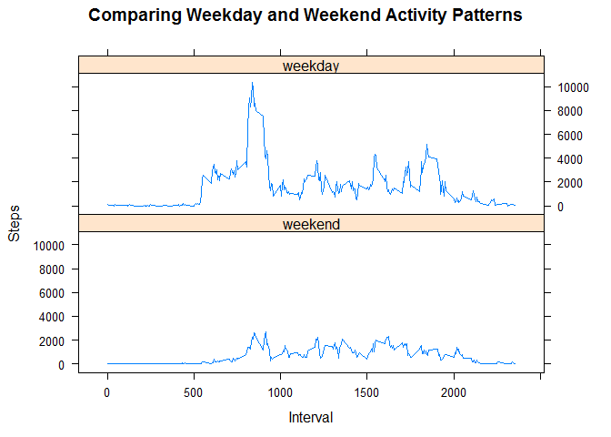

# Reproducible Research: Peer Assessment 1


## Project Information

###[Reproducible Research - Project 1](https://www.coursera.org/learn/reproducible-research/peer/gYyPt/course-project-1)

*This assignment makes use of data from a personal activity monitoring device. This device collects data at 5 minute intervals through out the day. The data consists of two months of data from an anonymous individual collected during the months of October and November, 2012 and include the number of steps taken in 5 minute intervals each day.*


The variables included in this dataset are:

1. **steps**: Number of steps taking in a 5-minute interval (missing values are coded as NA ) 
2. **date**: The date on which the measurement was taken in YYYY-MM-DD format 
3. **interval**: Identifier for the 5-minute interval in which measurement was taken


## Loading and preprocessing the data

```r
activity <- read.csv("./Data/activity.csv", header = T, stringsAsFactors = F)
```

## What is mean total number of steps taken per day?
<!-- For this part of the assignment, you can ignore the missing values in the dataset. -->
<!--     Make a histogram of the total number of steps taken each day -->
<!--     Calculate and report the mean and median total number of steps taken per day -->


```r
# Using dplyr, get total steps by date, omitting NAs
daily.total.steps <- activity %>%
    na.omit() %>%
    group_by(date) %>%
    summarise(daily.steps=sum(steps))
# make histogram of daily total steps
hist(daily.total.steps$daily.steps, breaks=30, 
     main = "Mean Steps Distribution", xlab = 'Average Steps', col = 'grey', cex.main = .5)
```

<!-- -->

```r
# Print Mean and Median
mean.steps <- round(mean(daily.total.steps$daily.steps), 1)
med.steps <-round(median(daily.total.steps$daily.steps), 1)
print(paste("Mean Steps per Day:",mean.steps,"     ", "Median Steps per Day:",med.steps))
```

```
## [1] "Mean Steps per Day: 10766.2       Median Steps per Day: 10765"
```


## What is the average daily activity pattern?
#####     Make a time series plot (i.e. type = "l") of the 5-minute interval (x-axis) and the average number of          steps taken, averaged across all days (y-axis)
#####    Which 5-minute interval, on average across all the days in the dataset, contains the maximum number of          steps?


```r
# Using dplyr, get average steps by interval, omitting NAs.
interval.average.steps <- activity %>%
    na.omit() %>%
    group_by(interval) %>%
    summarise(avg.steps=mean(steps))

# Scatter plot of avg steps taken per interval (time series)
plot(interval.average.steps$interval,
     interval.average.steps$avg.steps, 
     pch=20, 
     main = "Daily Activity Pattern", xlab = "Interval (Sequential 5 Minute Time Slot)", ylab = "Avg Steps")
```

<!-- -->

```r
interval.max <- interval.average.steps[which.max(interval.average.steps$avg.steps),]$interval
#Report interval with max steps
print(paste("Avg interval with max steps:",interval.max, "th interval",  sep = ""))
```

```
## [1] "Avg interval with max steps:835th interval"
```


## Imputing missing values
####   Note that there are a number of days/intervals where there are missing values (coded as NA). The presence of missing days may introduce bias into some calculations or summaries of the data.

#####Calculate and report the total number of missing values in the dataset (i.e. the total number of rows with NAs)

```r
print(paste("Numer of missing values:",sum(is.na(activity$steps))))
```

```
## [1] "Numer of missing values: 2304"
```

#####   Devise a strategy for filling in all of the missing values in the dataset. The strategy does not need to be sophisticated. For example, you could use the mean/median for that day, or the mean for that 5-minute interval, etc. Create a new dataset that is equal to the original dataset but with the missing data filled in.

```r
# using dplyr, replace NAs with mean for the interval. Assign to new dataset.
imputed.activity <- activity %>%
    group_by(interval) %>% mutate(steps = ifelse(is.na(steps), mean(steps, na.rm = T), steps))
```

#####   Make a histogram of the total number of steps taken each day and Calculate and report the mean and median total number of steps taken per day. Do these values differ from the estimates from the first part of the assignment? What is the impact of imputing missing data on the estimates of the total daily number of steps?  

```r
daily.total.steps.b <- imputed.activity %>%
    group_by(date) %>%
    summarise(daily.steps=sum(steps))
# make histogram of daily total steps
hist(daily.total.steps.b$daily.steps, breaks=30, 
     main = "Mean Steps Distribution Afting Imputing Missing Values", xlab = 'Total Number of Steps', col = 'grey', cex.main = .5)
```

<!-- -->

```r
# Print Mean and Median
mean.steps.b <- round(mean(daily.total.steps.b$daily.steps), 1)
med.steps.b <-round(median(daily.total.steps.b$daily.steps), 1)
print(paste("Mean Steps per Day:",mean.steps,"(before) ", "Median Steps per Day:",med.steps,"(before) "))
```

```
## [1] "Mean Steps per Day: 10766.2 (before)  Median Steps per Day: 10765 (before) "
```

```r
print(paste("Mean Steps per Day:",mean.steps.b,"(after)  ", "Median Steps per Day:",med.steps.b,"(after) "))
```

```
## [1] "Mean Steps per Day: 10766.2 (after)   Median Steps per Day: 10766.2 (after) "
```


## Are there differences in activity patterns between weekdays and weekends?

#####Create a new factor variable in the dataset with two levels - "weekday" and "weekend" indicating whether a given date is a weekday or weekend day.

```r
#convert strings to dates
imputed.activity$date <- as.Date(imputed.activity$date)
#Add classification column. Value determined using `%in%` and `weekdays` to create a logical vector
#convert to `factor` and specify the `levels/labels`
weekdays1 <- c('Monday', 'Tuesday', 'Wednesday', 'Thursday', 'Friday')
imputed.activity$classification <- factor((weekdays(imputed.activity$date) %in% weekdays1), 
         levels=c(FALSE, TRUE), labels=c('weekend', 'weekday')) 
```

#####Make a panel plot containing a time series plot (i.e. type = "l") of the 5-minute interval (x-axis) and the average number of steps taken, averaged across all weekday days or weekend days (y-axis). See the README file in the GitHub repository to see an example of what this plot should look like using simulated data.

```r
daily.total.steps.c <- imputed.activity %>%
    group_by(interval, classification) %>%
    summarise(daily.steps=sum(steps))
xyplot(daily.total.steps.c$daily.steps~daily.total.steps.c$interval|daily.total.steps.c$classification,
    main="Comparing Weekday and Weekend Activity Patterns",
    xlab="Interval",
    ylab="Steps",
    type = "l",
    layout=(c(1,2)))
```

<!-- -->

